## 🏗️ 5-Tier Full-Stack System Architecture

### 자동 미분 그래프 생성을 최소화하는 '순수 순방향 물리 합성 신경망 (Forward-Only Autograd-Free PINN)'

현대 딥러닝은 백프로퍼게이션(Backpropagation)을 통해 연산 그래프가 $O(N^2)$로 누적되어 상당한 VRAM을 소모하며, 불연속적 데이터 입력 시 수치 폭발(NaN/INF)이 발생하는 제약이 있습니다.

본 프로젝트는 기존 저의 프로젝트인  `fluid-mesh-hpc` 구조에서 영감을 받아, 무거운 전역 행렬 곱셈 대신 로컬 격자점의 차분 편차를 활용하는 수리 물리 기반 신경망 레이어를 제안합니다.

#### 💡 대안적 접근법 및 핵심 메커니즘
* **오토그라드 절연을 통한 정적 메모리화**: `jax.lax.stop_gradient`를 활용해 연산 복잡도를 정적 $O(1)$ 구조로 동결하고, VRAM 소모량을 추론(Inference) 수준으로 압축하여 하드웨어 부하를 줄입니다.
* **수리 물리 기반의 대수적 자율 정렬**: 와도(Vorticity) 기하학 공식을 응용하여 1차원 공간 편차($U = \text{East} - \text{West}$)를 기반으로, 데이터가 모델을 한 번 관통(Forward-Only)하는 동안 가중치 텐서가 물리 법칙에 따라 대수적으로 재정렬되도록 합니다.
* **수치 안정성을 위한 하드웨어 연산 융합**: 미소 소산 계수($\sigma = 0.00003125$) 기반의 유체 점성 브레이크 항을 사용합니다. 가속기 ALU 내부 레지스터 단에서 가중치 갱신 수식인 $(\mathbf{W} \times \gamma) + (\alpha \times \Delta)$ 형태(여기서 $\gamma$는 고정 감쇠 인자, $\alpha$는 학습률, $\Delta$는 컬 반전 변위)로 대수적 재배치를 가하여, FMA(Fused Multiply-Add) 최속 회로 내에서 단 1사이클 만에 효율적으로 처리되도록 유도합니다.

결과적으로 특정 수리 물리 시뮬레이션 환경에서 VRAM 소모량을 기존 대비 약 1/1000 수준으로 낮추어, 제한된 리소스에서도 고해상도 PINN 아키텍처가 실효성 있게 작동할 가능성을 탐색합니다.

---
# 1. Bare-Metal CUDA Kernel (격자 공간 구배 적출 레이어)

* **워프 셔플 기반의 무분기 공간 차분 (Warp-Shed Topology)**
  * 워프 내부(Lane 1~30)의 고속 연산 구간에는 레지스터 간 직통 통신인 셔플 인트린직(`__shfl_up_sync`, `__shfl_down_sync`)을 적용하여, 전역 메모리 접근을 줄이고 1차원 공간 편차($U = \text{East} - \text{West}$) 스캔을 효율적으로 적출하도록 유도했습니다.
  * 워프 양 끝단(Lane 0, 31) 및 블록 경계선 스레드는 전역 메모리 재요청(Re-load) 지연을 완화하고자, 이미 가동된 공유 메모리(`__shared__`) 패딩 영역의 데이터를 재사용하여 상속받는 구조를 시도했습니다.
* **공유 메모리 가상 마스킹을 통한 워프 분기 분산 완화 (Garbage Index Masking)**
  * 경계 조건 처리 시 특정 스레드만 공유 메모리에 접근할 때 발생하는 워프 분기 분산(Warp Divergence)을 줄이기 위해, 공유 메모리 레이아웃 맨 끝단에 격리 슬롯인 쓰레기통 주소(`GARBAGE_IDX`) 영역을 가설로 도입했습니다.
  * 256개 스레드가 개별 조건문 분기 없이 일제히 대칭 Store 명령을 실행하되, 유효하지 않은 경계 연산 결과는 쓰레기통 주소로 자연스럽게 흡수·유실되도록 유도하여 하드웨어 레벨의 조건부 선택 명령어(SEL) 평탄화를 실험적으로 확인해 보았습니다.
* **나눗셈 연산 및 예외 처리 가속 가드**
  * 부동소수점 나눗셈 연산이 가속기 파이프라인에 주는 높은 오버헤드를 우회하기 위해, 하드웨어 실리콘 Constant 메모리 영역에 64요소 상반수 역수 룩업 테이블(`RECIPROCAL_CELL_LUT`)을 내장하여 단일 사이클 DSP 곱셈 연산으로 전환을 꾀했습니다.
  * 수치 폭발(NaN/INF) 및 결함 마커 유입 시, 제어 파이프라인의 정체를 방지하기 위해 분기문 없는 조합 논리 조건식(`pinn_check_hardware_anomaly`)을 통해 청정 베이스라인(`0.0f`) 상태로 즉각 리셋 및 플러시되도록 구현했습니다.

---

# 1.5. C++ Interlock Bridge (제로카피 VRAM 터널링 레이어)

* **물리 주소선 기반의 제로카피 수송 파이프라인 (Zero-Copy Forwarding)**
  * `pybind11` 및 글로벌 가속기 텐서 바인딩 표준 규격인 `__cuda_array_interface__` v3를 활용하여, 호스트-디바이스(H2D/D2H) 간의 물리적 데이터 복사 오버헤드와 PCIe 대역폭 점유율을 제로(0) 수준으로 낮추는 경로를 탐색했습니다.
  * 데이터 인입 경로 상에 C++20 `[[unlikely]]` 경계 보호 게이트를 임베딩하여, 예외 처리 어셈블리 코드를 명령어 캐시의 핫 패스 바깥으로 격리함으로써 CPU 파이프라인 스톨 오버헤드를 평탄화하고자 했습니다.
* **4채널 독립 SoA 오프셋 분해 및 보폭 제안 (Strides = 32 Channel Freezing)**
  * 상위 JAX/XLA 컴파일러 단의 임의적인 레이아웃 변형(Transpose/Re-stride) 및 슬라이싱 오버헤드를 보수적으로 방어하고자, 하부 물리 바이트 오프셋 레벨에서 4개의 독립된 채널 딕셔너리(`param_w`, `spatial_u`, `spatial_v`, `adaptive_gain`)로 구조를 분해했습니다.
  * 1차원 데이터 형상을 유지하면서 다음 원소 스캔 오프셋 보폭(Strides)을 구조체 전체 크기인 `sizeof(PinnCell32) = 32`로 고정 결착시켜, 가속기 메모리 버스가 16바이트 제어 및 패딩 영역을 물리적으로 스킵 점프하며 효율적으로 float 성분만 참조할 수 있도록 유도했습니다.
* **파이썬 가비지 컬렉터 간섭 절연 가드 (Empty Deleter Lifecycle Fence)**
  * 물리 하드웨어 자원의 메모리 수명 주기를 하부 로우레벨 영역에 일임하고, 파이썬 가비지 컬렉터(GC)의 비동기적 수거 시도로 인한 미세한 런타임 지터(Stop-the-world) 진입을 방지하고자 빈 디리터(Empty Deleter) 람다가 포함된 커스텀 캡슐 펜스를 적용해 보았습니다.
* **컴파일 타임 정적 사양 검증 구조 (Compile-Time Sanity Firewall)**
  * C++20 표준 `static_assert` 명세를 명시적으로 도입하여 `PinnCell32` 구조체의 크기가 정확히 32바이트를 만족하는지, 정렬(Alignment) 규격이 어긋나지 않았는지 빌드 단계에서 엄격히 검증하도록 유도했습니다.
  * 이를 통해 상위 가속 프레임워크가 인플레이스(In-place) 조작을 가할 때 일어날 수 있는 물리 레이아웃 뒤틀림 및 세그멘테이션 폴트(SegFault) 위험성을 사전에 방어하고자 노력했습니다.

---

# 2. Autograd-Insulated JAX Core (대수적 위상 자율 정렬 레이어)

* **그레디언트 그래프 생성을 제한하는 역전파 차단 격리막 (Autograd Insulation)**
  * 데이터가 JAX 엔진 초입에 진입하는 즉시 `lax.stop_gradient` 격리막을 선제 인가하여, 중간 활성화 텐서(Activation) 보존을 위한 연산 그래프 추적 사슬을 차단하고자 했습니다.
  * 하부 수치 정화 MUX 게이트인 `enforce_algebraic_safety_gate`를 결합하여 절대 임계치인 $1.0 \times 10^6$ (GLOBAL THRESHOLD) 및 결함 토큰인 $-99.0$ (FAULT SIGNATURE) 유입 좌표를 0ns 단위로 원자적 플러시하는 방어선을 구축했습니다.

  * 이를 통해 연산 메모리 복잡도를 해상도 증가에 따른 제곱 형태 $O(N^2)$에서 정적 $O(1)$ 레이아웃으로 유도함으로써, 대규모 분산 학습 시 학습용 VRAM 소모량을 대폭 절감하여 하드웨어 인프라 부하를 추론(Inference) 수준으로 압축하는 아키텍처를 시도해 보았습니다.
* **물리 법칙 기반의 대수적 잔차 상쇄 (Cross-Axis Curl Inversion)**
  * 복잡한 역전파 그레디언트 디센트 수렴 과정 대신, 유체의 와도(Vorticity) 기하학 공식을 응용하여 수직 편차 항의 부호를 반전한 채 가중치 자율 보정 변위 벡터(`curl_inverted_u`, `curl_inverted_v`)를 직접 대수 합성하는 최적화 우회를 꾀했습니다.
* **FMA 하드웨어 명령어 유도를 위한 수식 재전개 (1-Cycle FMA Execution Path)**
  * 오토그라드가 배제된 환경에서 가중치의 수치적 발산을 제어하기 위해, 미소 소산 계수인 $\sigma = 0.00003125$ (SIGMA DISSIPATION)가 주입된 유체 점성 브레이크 항을 수학적으로 적용했습니다.
  * 가중치 갱신 수식을 $(\mathbf{W} \times \gamma) + (\alpha \times \Delta)$ 형태로 재배치(여기서 $\gamma$는 고정 감쇠 인자 `DECAY_FACTOR`, $\alpha$는 학습률, $\Delta$는 컬 반전 변위)하여 가속기 ALU 내부 레지스터 단의 곱셈·덧셈 파이프라인 스톨을 최소화하고, FMA(Fused Multiply-Add) 최속 회로 내에서 단 1사이클 만에 효율적으로 통합 처리되도록 조심스럽게 유도해 보았습니다.
* **버퍼 재사용 기반의 인플레이스 가중치 전사 (Donate-Buffer In-place Overwrite)**
  * 최외곽 융합 파이프라인(`_fused_xla_update_step`) 및 정적 순수 함수 구조에 `@functools.partial(jax.jit, donate_argnums=(0,))` 명세를 배치하여 가중치 버퍼의 VRAM 재사용을 철저히 락킹했습니다.
  * 이를 통해 매 스텝마다 불필요한 임시 버퍼가 VRAM에 재할당되는 기회비용을 낮추고, C++ 물리 주소선(`param_w`)이 가리키는 원본 가속기 메모리 영역 위에서만 순수 인플레이스(In-place)로 가중치가 직접 덮어써지도록 유도했습니다.

---

# 3. Asynchronous Infrastructure Governance (분산 노드 거버넌스 사령탑)

* **이벤트 기반의 제로 오버헤드 관제 체계 (Passive Event-Driven Monitoring)**
  * 평상시 연산 활성 상태에서는 불필요한 계산 자원을 소모하는 무거운 폴링(Polling) 루프를 배제하고, 오직 특정 하드웨어 인터럽트 신호가 인입될 때만 반응하는 비동기 이벤트 루프 구조를 채택했습니다.
  * 99.9%의 정상적인 물리 평형 가동 조건 하에서는 관제 계산 부하를 최소화(`hardware_marker_signal == 0.0` 조건 패스)하여, 대규모 AI 가속 스트리밍 경로(Data Path)에 미치는 간섭을 격리 차단하는 `Strict Zero` 베이스라인을 시험해 보았습니다.
* **자원 경합 방지를 위한 비동기 원자적 가드 (Async Mutex Synchronization)**
  * 하부 실리콘 커널 및 분산 격자점 뱅크에서 수치 폭발이나 하드웨어 결함 마커(`-99.0f`) 인터럽트가 폭발적으로 유입(Burst)되는 최악의 물리적 한계 상황을 보수적으로 상정했습니다.
  * 공유 백업 자원 풀의 안전성을 확보하기 위해 `asyncio.Lock` 가드 메커니즘을 결착시켜, 다중 고장 알림 노드 간의 자원 할당 경쟁 상태(Race Condition)를 원자적으로 제어하도록 유도했습니다.
* **가상 주소선 리다이렉션 및 핫플러깅 (Cold Standby Address Hot-Swapping)**
  * 상시 전력 소모를 차단한 채 물리 주소선만 락킹해 둔 `Cold Standby` 예비 가속기 노드 토폴로지 맵(기본 `cold_standby_pool_size = 5`)을 설계하여 비상 인프라 풀을 확보했습니다.
  * 가중치 프로파일 훼손 인터럽트 적출 즉시 파이썬 단의 포인터 오프셋 교체(Hot-swap)를 연쇄 유도하는 한편, 가중치가 자율 대수 정정을 완료하는 순간 정성 플러그 신호(`1.0`)를 역으로 수입하여 `param_w(중심 유동장)`, `spatial_u(동서 구배)` 등 4대 독립 채널의 정상 위상 복구 여부를 인간-기계 인터페이스(HMI) 관제에 안전하게 직송하는 메커니즘 가이드라인을 정립했습니다.

---

# [OUTPUT / HOMEOSTASIS] ➔ 미분 없는 실시간 상태 위상 평형 및 물리 항상성 완결

```mermaid
graph TD
    %% 스타일 정의
    classDef inputStyle fill:#1a1a1a,stroke:#333,stroke-width:2px,color:#fff;
    classDef layerStyle fill:#2d3748,stroke:#4a5568,stroke-width:1px,color:#fff;
    classDef alertStyle fill:#742a2a,stroke:#e53e3e,stroke-width:1px,color:#fff;
    classDef outputStyle fill:#1c4ed8,stroke:#3b82f6,stroke-width:2px,color:#fff;

    %% 노드 정의
    INPUT["📥 INPUT STREAM <br> 수치해석 격자점 데이터 스트림 실시간 인입"]:::inputStyle

    subgraph L1 [1. Bare-Metal CUDA Kernel]
        L1_Core["격자 공간 구배 적출 레이어"]
        L1_1["Warp Shuffle Intrinsic 및 공유 메모리 패딩<br>(전역 메모리 참조 지연 완화)"]
        L1_2["Constant 메모리 LUT 기반 역수 추출<br>(부동소수점 하드웨어 나눗셈 병목 우회)"]
        L1_3["Garbage Index Masking 및 MUX 선택 구조<br>(Warp Divergence 제어 및 예외 플러시)"]
    end
    style L1 fill:#1a202c,stroke:#4a5568,color:#fff

    subgraph L15 [1.5 C++ Interlock Bridge]
        L15_Core["제로카피 VRAM 터널링 레이어"]
        L15_1["pybind11 & __cuda_array_interface__ v3<br>(물리 주소선 기반 0ns 수송 파이프라인)"]
        L15_2["4채널 독립 SoA 오프셋 분해 및 strides=32 제한<br>(상위 프레임워크 단 구조 변형 예방)"]
        L15_3["Empty Deleter 및 static_assert 검증<br>(파이썬 GC 간섭 절연 및 빌드 타임 사양 검증)"]
    end
    style L15 fill:#1a202c,stroke:#4a5568,color:#fff

    subgraph L2 [2. Autograd-Insulated JAX Core]
        L2_Core["대수적 위상 자율 정렬 레이어"]
        L2_1["lax.stop_gradient 격리막 인가<br>(활성화 텐서 추적 차단 및 VRAM O-1 동결)"]
        L2_2["교차축 컬 반전 및 점성 브레이크 항 결합<br>(대수적 잔차 평형 유도 및 수치 발산 제어)"]
        L2_3["FMA 명령어 융합을 위한 수식 평탄화<br>(가속기 ALU 1사이클 연산 및 스톨 최적화)"]
        L2_4["@functools.partial 및 donate_argnums 적용<br>(기존 가중치 버퍼 기반 인플레이스 덮어쓰기 완료)"]
    end
    style L2 fill:#1a202c,stroke:#4a5568,color:#fff

    subgraph L3 [3. Asynchronous Infrastructure Governance]
        L3_Core["분산 노드 거버넌스 사령탑<br>(평상시 연산 부하 최소화 및 제어 플레인 격리)"]
        L3_1["결함 인터럽트 신호 포획<br>(-99.0f 하드웨어 폴트 마커 비동기 핀포인트 스캔)"]
        L3_2["asyncio.Lock 컨텍스트 가드 작동<br>(다중 고장 알림 발생 시 자원 경합 원자적 제어)"]
        L3_3["Cold Standby 예비 물리 노드 리다이렉션<br>(다운타임 최소화를 위한 비상 주소선 핫스왑 제어)"]
    end
    style L3 fill:#2d1a2c,stroke:#684a65,color:#fff

    OUTPUT[" OUTPUT / HOMEOSTASIS <br> 미분 없는 실시간 상태 위상 평형 및 물리 항상성 완결"]:::outputStyle

    %% 연결선 정의
    INPUT --> L1_Core
    L1_Core --> L1_1 --> L1_2 --> L1_3
    L1_3 --> L15_Core
    L15_Core --> L15_1 --> L15_2 --> L15_3
    L15_3 --> L2_Core
    L2_Core --> L2_1 --> L2_2 --> L2_3 --> L2_4
    
    %% 제어 및 예외 흐름
    L1_3 -. 하드웨어 결함 모니터링 .-> L3_1
    L2_4 -. 수치 예외 모니터링 .-> L3_1
    
    L3_1 --> L3_2 --> L3_3
    
    L2_4 --> OUTPUT
    L3_3 -. 예비 물리 자원 라우팅 .-> OUTPUT

```

---

## 📉 Core Technological Innovations

### 1. Autograd-Insulated Core (미분 경로 절연 및 정적 메모리 할당)
수치해석 데이터가 엔진 초입에 진입함과 동시에 미분 사슬을 차단하여, 중간 활성화 텐서(Activation) 보존을 위한 VRAM 잔존 추적 그래프를 청산하도록 유도했습니다. 이를 통해 연산 복잡도를 공간 해상도 증가에 따른 제곱 형태 $O(N^2)$에서 정적 계층 구조인 $O(1)$ 레이아웃으로 동결시킴으로써, 대규모 분산 학습 시 학습용 VRAM 소모량을 낮추어 하드웨어 인프라 부하를 추론(Inference) 수준으로 압축 및 완화하는 대안적 패러다임을 제안합니다.

### 2. Register-Level Central Difference & Warp Shuffle (레지스터 기반 차분 가속)
1차원 공간 차분 편차($U = \text{East} - \text{West}$) 도출 시, 이웃 격자점 참조를 위해 전역 메모리 버스에 반복 접근하는 지연 병목을 완화하고자 했습니다. GPU 내부의 고속 데이터 레일인 워프 셔플 인트린직(`__shfl_up_sync`, `__shfl_down_sync`)과 주소선 제어 장치인 쓰레기통 주소 마스킹(`Garbage Index Masking`)을 결합하여, 32개 스레드가 워프 분기 분산(Warp Divergence)에 따른 스톨을 완화하면서 나노초 단위로 공간 구배 가닥을 병렬 적출하도록 구현해 보았습니다.

### 3. Cross-Axis Curl Inversion & FMA Hardware Interlock (교차축 반전 및 하드웨어 연산 융합)
기존의 그레디언트 디센트 탐색을 수행하는 대신, 유체의 와도(Vorticity) 기하학 공식을 응용하여 수직 편차 항의 부호를 반전한 채 가중치 자율 보정 변위 벡터로 교차 매핑하는 방식을 취했습니다. 오토그라드가 배제된 환경에서의 수치적 발산을 제어하기 위해 미소 소산 계수 $\sigma = 0.00003125$ 기반의 유체 점성 브레이크 항을 수학적으로 융합하고, 가중치 갱신 수식을 $(\mathbf{W} \times \gamma) + (\alpha \times \Delta)$ 형태로 재배치하여 가속기 ALU 내부 레지스터 단에서 FMA(Fused Multiply-Add) 최속 회로 내 단 1사이클 만에 효율적으로 처리되도록 유도했습니다.

### 4. Zero-Copy Stride Multi-Channel Solver (제로카피 다중 채널 인터록)
CUDA Bare-Metal 단의 32바이트 물리 정렬 구조체 레이아웃에서 상위 연산에 필수적인 `param_w`, `spatial_u`, `spatial_v` 필드만을 JAX 텐서 뷰(View)로 다이렉트 인터록 연동을 구현했습니다. 호스트-디바이스(H2D/D2H) 간의 물리적 버퍼 할당 및 데이터 복사 오버헤드를 우회하고 다음 원소 스캔 오프셋 보폭을 구조체 전체 크기인 32바이트로 고정하여, 가속기 메모리 버스 부하를 완화하고 캐시라인 파편화 가능성을 사전에 보수적으로 방어하고자 했습니다.

### 5. Fault-Tolerant Infrastructure Governance (비동기 결함 허용 제어 인프라)
하부 실리콘 레벨에서 유입되는 수치 폭발 및 하드웨어 파손 신호(`-99.0f`) 스캔과 상위 분산 노드의 백업 라우팅 맵 빌드를 수직으로 일체화하는 실험을 전개했습니다. 평상시에는 연산 부하 최소화(Strict Zero 베이스라인)를 만족하는 패시브 이벤트 구동형 제어 플레인을 유지하다가, 결함 발생 인터럽트 포획 시 `asyncio.Lock` 메커니즘을 작동시켜 자원 할당 경쟁 상태(Race Condition)를 원자적으로 제어하고 0ns 단위로 Cold Standby 예비 물리 노드로 주소선을 우회 스와핑하는 무중단 자율 복구 구조를 가이드라인으로 수립했습니다.

---

## 📌 Project Architecture & Files

* **`backend_core.cu` (Layer 1: Bare-Metal CUDA Kernel)**
  * 공유 메모리 패딩 존 및 워프 셔플 인트린직 연동을 통한 1차원 공간 유한차분 가속 명세를 구현한 커널입니다.
  * 쓰레기통 주소 마스킹(`Garbage Index Masking`) 가설과 무분기 선택자(`pinn_branchless_select_f32`)를 결합하여 Warp Divergence 분기를 완화하는 실리콘 단독 계산 루틴을 포함하고 있습니다.
* **`bridge_wrapper.cpp` (Layer 1.5: C++ Interlock Bridge)**
  * `__cuda_array_interface__` v3 규격을 인터록하여 물리 주소선 기반으로 디바이스 메모리를 JAX로 직송하는 제로카피 수송 관로 스크립트입니다.
  * 구조체 보폭 제한 기믹(`strides=32`)을 활용해 `sizeof(PinnCell32) = 32` 규격을 동결하고, C++20 `[[unlikely]]` 속성과 `static_assert` 정적 검증 파이프라인을 통해 명령어 캐시 최적화와 안정성을 동시에 도모했습니다.
* **`pinn_brain.py` (Layer 2: Autograd-Insulated JAX Core)**
  * `lax.stop_gradient` 격리막을 초입부터 결착하여 활성화 텐서의 VRAM 수치 누적 추적 그래프를 최소화하는 오토그라드 프리 수리 수학 엔진입니다.
  * 미소 소산 계수 기반의 유체 점성 브레이크 항과 1사이클 하드웨어 FMA 연산 유도 식, `@donate_argnums` 가중치 버퍼 기증 매커니즘을 융합하여 가중치가 스스로 대수 정렬을 이룰 수 있는 가능성을 실험하는 인공지능 코어입니다.
* **`main_orchestrator.py` (Layer 3: Asynchronous Infrastructure Governance)**
  * 평상시 연산 오버헤드를 최소화(`Strict Zero` 베이스라인)하여 대규모 AI 가속 데이터 경로 간섭을 차단하도록 고안된 패시브 이벤트 구동형 제어 사령탑입니다.
  * 하부 레이어에서 `-99.0f` 결함 신호가 다발적으로 인입될 때 자원 할당 경쟁 상태(Race Condition)를 제어하기 위한 `asyncio.Lock` 가드 및 예비 노드 주소선 핫스왑 매커니즘을 포함하고 있습니다.

---
