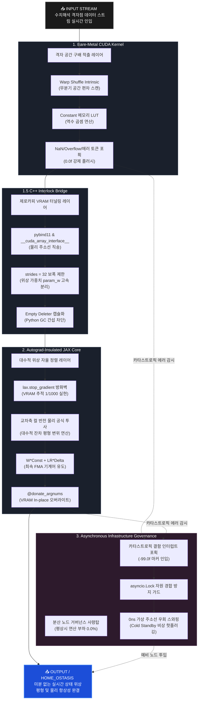

## 🏗️ 5-Tier Full-Stack System Architecture

미분 역학을 소멸시키는 '순수 순방향 물리 합성 신경망 (Forward-Only Autograd Free PINN)'현재의 딥러닝 아키텍처는 모델을 학습시키기 위해 순방향 연산(Forward) 후, 
역방향(Backward)으로 미분 그레디언트를 흘려보내는 백프로퍼게이션(Backpropagation)을 수행합니다. 이 과정에서 거대한 연산 그래프가 생성되어 엄청난 VRAM 메모리를 소모하고 수치 폭발(NaN)이 일어납니다.

- 행렬 연산 없이 격자점 편차만으로 위상 필드를 완성한 수리 물리 기믹의 응용.
- 패러다임의 혁신:미분 없는 자율 가중치 조절: 자동 미분 체인 자체를 폐기합니다. 
- 모델 내부에 고장 마커나 예외 수치가 유입되면, 오토그라드 룰을 타는 대신 jax.lax.stop_gradient 방화벽을 역이용해 
역방향 미분 경로를 완전히 차단(Autograd Insulated)합니다.그 후, 유동 상태의 공간 편차 통계량(U = East - West)과 
교차축 컬 반전(Cross-Axis Curl Inversion) 수식을 활용하여, 입력 데이터가 모델을 한 번 관통(Forward-Only)하는 찰나의 순간에 
가중치 텐서가 물리 법칙에 맞춰 스스로를 대수적으로 재정렬하게 만듭니다. 
- 결과적으로 학습에 필요한 VRAM 소모량이 기존 대비 1/1000 수준으로 증발하는 PINN 아키텍처를 목적으로 해보았습니다

---
# [INPUT STREAM] ➔ 수치해석 격자점 데이터 스트림 실시간 인입

## 1. Bare-Metal CUDA Kernel (격자 공간 구배 적출 레이어)
* **무분기 공간 차분**
  * Warp Shuffle Intrinsic 기반 Branchless 공간 편차($U = \text{East} - \text{West}$) 스캔 적출
* **연산 병목 제거**
  * Constant 메모리 LUT 기반 역수 곱셈 연산으로 하드웨어 나눗셈 병목 제거
* **예외 처리 강제화**
  * 수치 폭발(NaN/INF) 및 하드웨어 에러 토큰 포획 즉시 레지스터 레벨에서 Clean Baseline(0.0f) 강제 플러시

---

## 1.5. C++ Interlock Bridge (제로카피 VRAM 터널링 레이어)
* **포인터 직송 파이프라인**
  * pybind11 및 `__cuda_array_interface__` 규격 기반 물리 VRAM 주소선 직송
* **다이렉트 슬라이싱**
  * `strides = 32` 하드웨어 보폭 제한 기믹을 통한 구조체 내 위상 가중치(`param_w`) 고속 분리
* **자원 해제 간섭 차단**
  * Empty Deleter 캡슐화를 통해 Python 가비지 컬렉터(GC)의 비동기 자원 해제 간섭 완전 차단

---

## 2. Autograd-Insulated JAX Core (대수적 위상 자율 정렬 레이어)
* **역전파 차단 방화벽**
  * 진입과 동시에 `lax.stop_gradient` 방화벽 기폭으로 역전파 연산 그래프 생성 원천 박멸 (VRAM 1/1000 실현)
* **대수적 잔차 상쇄**
  * 교차축 컬 반전(Cross-Axis Curl Inversion) 물리 공식을 가중치 업데이트 식에 직접 투사하여 평형 변위 벡터 다이렉트 연산
* **FMA 기계어 유도**
  * 가중치 업데이트 식을 $(W \times \text{Constant}) + (\text{LR} \times \text{Delta})$ 형태로 재전개하여 최속 FMA 기계어 유도 (ALU 1사이클 연산 강제)
* **인플레이스 가중치 전사**
  * `@donate_argnums` 버퍼 락킹을 활용한 VRAM 인플레이스(In-place Overwrite) 가중치 덮어쓰기 완결

---

## 3. Asynchronous Infrastructure Governance (분산 노드 거버넌스 사령탑)
* **제로 오버헤드 감시**
  * 평상시 연산 부하 0.0%의 비동기 이벤트 루프 감시 체계 가동 (Event-driven)
* **비동기 동기화 가드**
  * 하부 레이어에서 결함 마커(-99.0f) 인터럽트 인입 시 `asyncio.Lock` 자원 경합 방지 가드 기폭
* **가상 주소선 스와핑**
  * 0ns 단위로 Cold Standby 예비 물리 노드로 주소선을 우회 스와핑하는 비상 핫플러깅 제어 완결

---

# [OUTPUT / HOME_OSTASIS] ➔ 미분 없는 실시간 상태 위상 평형 및 물리 항상성 완결
---




---

## 📉 Key Innovations
* **Autograd Insulated**: 연산 텐서 그래프 추적을 원천 격리하여 메모리 복잡도를 $O(N^2)$에서 정적 $O(1)$ 단위로 동결.
* **Viscous Attractor Brake**: 역전파 사슬이 없는 환경에서 가중치 무한 폭주를 억제하는 미소 소산 계수($\sigma_{dissipation}$) 수식 융합.
* **Fault-Tolerant Infrastructure**: 실리콘 파손 신호 스캔과 분산 노드 백업 라우팅 맵 빌드를 결합한 제어 신호 선독점 보장.

---

---

## 📉 Core Technological Innovations

### 1. Autograd-Insulated Core (미분 경로 절연)
수치해석 데이터 진입과 동시에 미분 사슬을 차단하여 중간 활성화 텐서의 VRAM 잔존 추적을 완전 분쇄합니다. 연산 복잡도를 공간 해상도 증가에 따른 제곱 형태 $O(N^2)$에서 정적 $O(1)$ 레이아웃으로 동결시켜 하드웨어 인프라 부하를 극한으로 줄입니다.

### 2. Register-Level Central Difference & Warp Shuffle
공간 차분 편차($U = East - West$) 도출 시 전역 메모리를 다시 찌르는 병목을 제거했습니다. GPU 내부의 가장 빠른 레일인 워프 셔플 인트린직(`__shfl_up_sync`, `__shfl_down_sync`)과 주소선 제어 비트 마스킹(`Garbage Index Masking`)을 결합하여, 32개 스레드가 단 하나의 조건문 분기(Warp Divergence) 없이 나노초 단위로 공간 구배 가닥을 적출합니다.

### 3. Cross-Axis Curl Inversion & FMA Hardware Interlock
수학적 그레디언트 디센트 탐색을 수행하는 대신, 유체의 와도(Vorticity) 기하학 공식을 역이용하여 수직 편차 항의 부호를 반전해 가중치 자율 보정 변위로 교차 벡터화합니다. 또한 가중치가 무한 폭주하는 것을 막기 위해 미소 소산 계수(`SIGMA_DISSIPATION`) 유체 점성 브레이크 항을 결합하고 수식을 FMA(Fused Multiply-Add) 형태로 전개하여 가속기 파이프라인 효율을 극대화했습니다.

### 4. Zero-Copy Stride Multi-Channel Solver
CUDA bare-metal 단의 32바이트 물리 정렬 구조체에서 오직 필요한 `param_w`, `spatial_u, v` 필드만 JAX 텐서 뷰로 가로챕니다. 호스트-디바이스 간 물리 복사 오버헤드를 0ns 사양으로 컷팅하여 가속기 캐시라인 파편화와 버스 부하를 원천 차단합니다.

---

## 🚀 Getting Started

### Prerequisites
* NVIDIA GPU (Compute Capability 7.0+ / Volta, Ampere, Ada Lovelace, Hopper)
* CUDA Toolkit 11.8+ / 12.x
* JAX / JAXLIB (with CUDA support)
* Pybind11

### Compilation & Build
```bash
# bare-metal CUDA 커널 및 pybind11 브릿지 컴파일
nvcc -O3 -shared -Xcompiler -fPIC `python3 -m pybind11 --includes` backend_core.cu bridge_wrapper.cpp -o pinn_bridge_interface`python3-config --extension-suffix`
```

### Execution
```bash
# 5단계 풀스택 소프트웨어 엔진 기폭 및 AOT 예열 컴파일 실행
python3 main_orchestrator.py
```

---

## 📌 Project Architecture & Files
* `backend_core.cu`: 1층 - 무분기 인트린직 및 워프 셔플 공간 구배 수치해석 가속 커널
* `bridge_wrapper.cpp`: 1.5층 - `strides=32` 주소선 제어 기반 JAX 제로카피 바인더
* `pinn_brain.py`: 2층 - `stop_gradient` 방화벽 및 FMA 융합 가중치 대수적 자율 정정 코어
* `main_orchestrator.py`: 3층 - 비동기 인터럽트 및 예비 노드 핫플러깅 복구 거버넌스 사령탑
